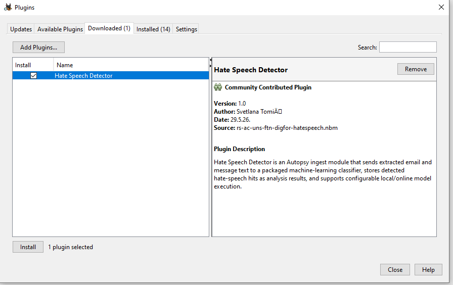
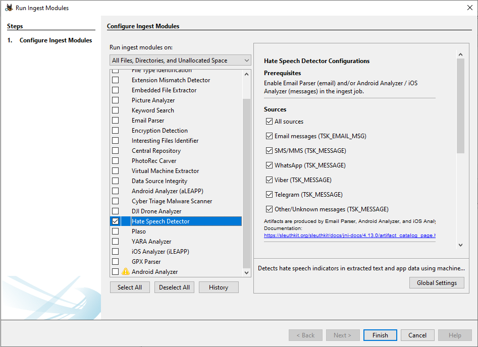
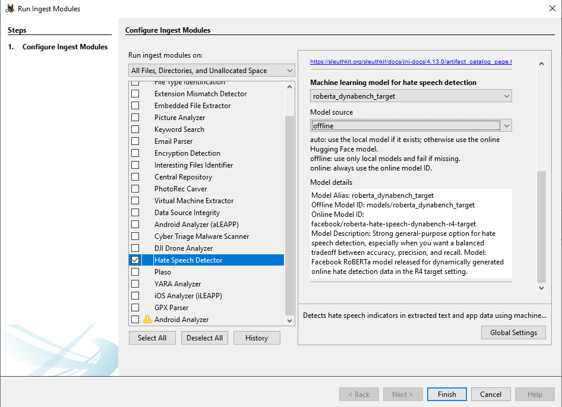
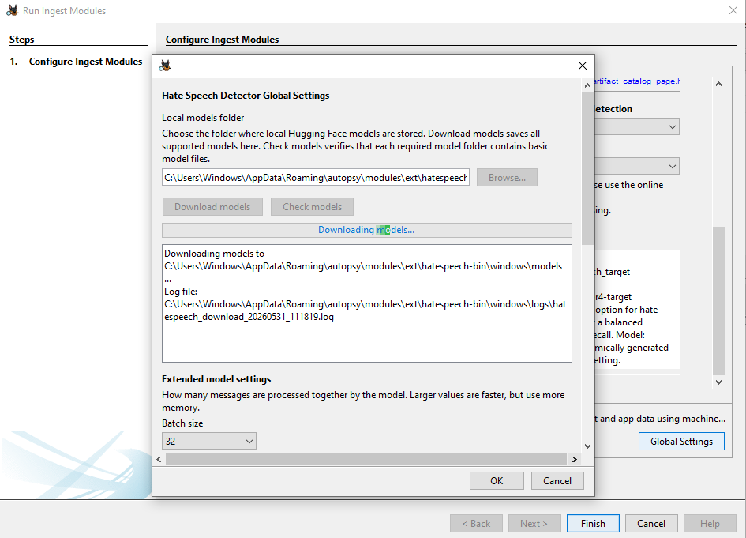
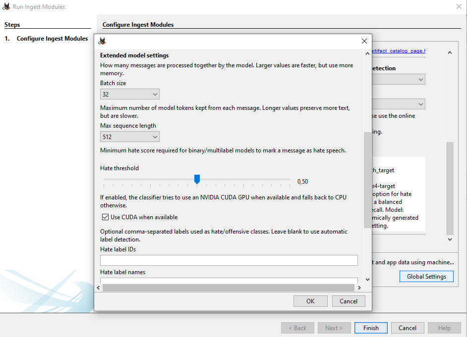
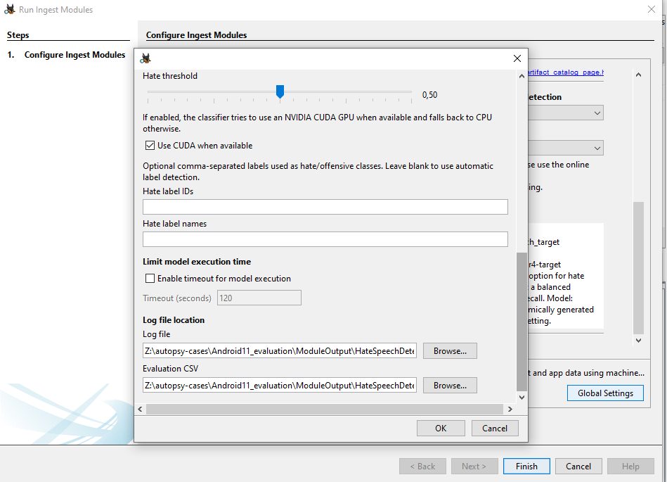
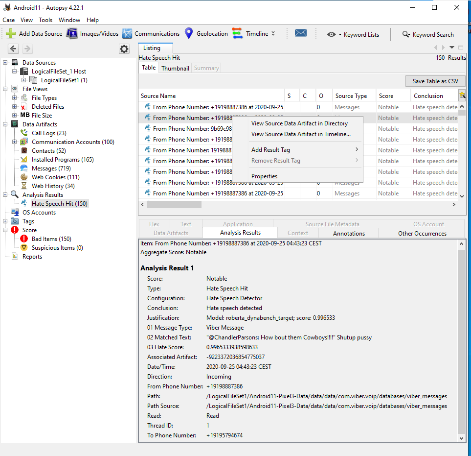
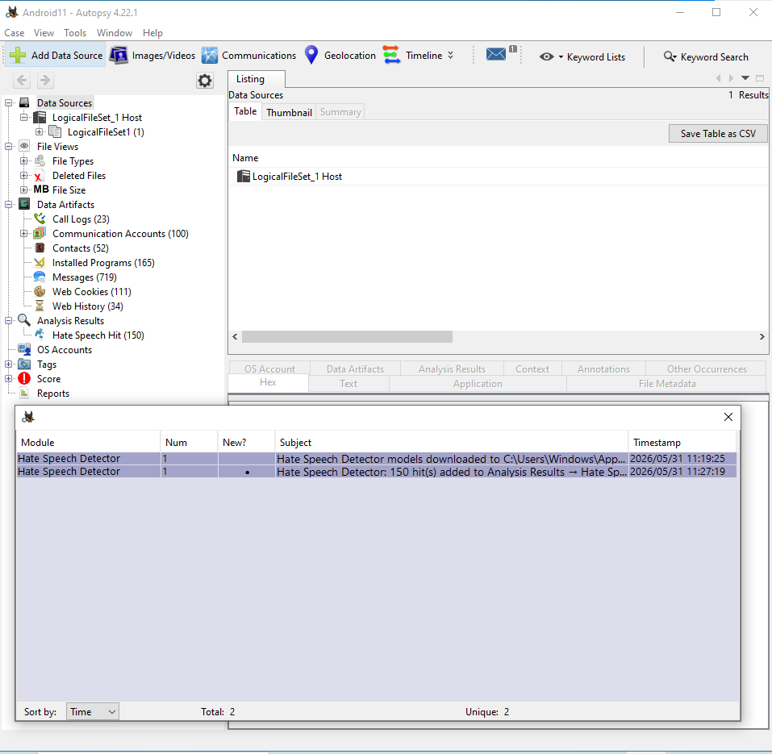
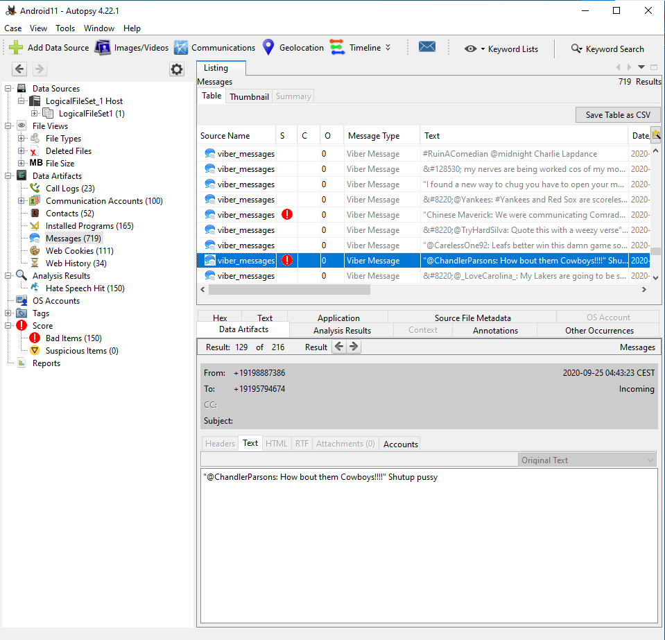

# Hate Speech Detector (Autopsy Plugin)

Hate Speech Detector is an Autopsy data source ingest plugin that scores email and message artifacts for hate speech and posts an analysis result per message for fast triage.

**What It Does**

- Runs during Autopsy ingest and scans email, SMS/MMS, and supported chat message artifacts.
- Extracts message text, sends it to the bundled hate-speech classifier, and records the returned score.
- Highlights likely hate-speech content as Autopsy analysis results so investigators can review it quickly.
- Collects `TSK_EMAIL_MSG` and `TSK_MESSAGE` artifacts.
- Sends text to a packaged Python CLI over stdin/stdout.
- Creates one analysis result per message in `Analysis Results -> Hate Speech Hit`.

**Requirements**

- Autopsy with the Email Parser, Android Analyzer, or iOS Analyzer enabled so message artifacts exist.
- Packaged Python CLI executable at `modules/ext/hatespeech-bin/windows/hatespeech_cli_v1.exe`.
- Java module built and installed as an `.nbm` plugin.

**Install**

1. Build or obtain the Python CLI executable and place it at `modules/ext/hatespeech-bin/windows/hatespeech_cli_v1.exe`.
2. Build the Java module `.nbm` from the `hatespeech/` project.
3. In Autopsy, go to `Tools -> Plugins -> Downloaded` and install the `.nbm`.

    

**Run**

1. Enable the module in the ingest job settings.
2. Configure the plugin settings.
3. Run ingest.
4. Results appear under `Analysis Results -> Hate Speech Hit`.

**Plugin Settings**

- **Sources**: selects which Autopsy message artifacts are processed during ingest. Available source filters are Email, SMS/MMS, WhatsApp, Viber, Telegram, and Other/Unknown.
- **Model source alias**: selects the hate-speech classifier model alias passed to the Python CLI.
- **Model source**: controls where the selected model is loaded from:
  - `auto`: use a local model when available, otherwise download/load it from the configured online source.
  - `offline`: use only locally available model files.
  - `online`: load the model from the online model source.

Models Catalog:

- `electra_hatexplain` ([TehranNLP-org/electra-base-hateXplain](https://huggingface.co/TehranNLP-org/electra-base-hateXplain)).
- `roberta_dynabench_target` ([facebook/roberta-hate-speech-dynabench-r4-target](https://huggingface.co/facebook/roberta-hate-speech-dynabench-r4-target)).
- `roberta_twitter_hate_latest` ([cardiffnlp/twitter-roberta-base-hate-latest](https://huggingface.co/cardiffnlp/twitter-roberta-base-hate-latest)).
- `bert_hatexplain_cnerg` ([Hate-speech-CNERG/bert-base-uncased-hatexplain](https://huggingface.co/Hate-speech-CNERG/bert-base-uncased-hatexplain)).

  
  

**Plugin Global Settings**

- `Local models folder`: choose where Hugging Face models are stored locally.
- `Download models`: downloads all supported models to the selected local folder for offline use.
- `Check models`: verifies that the required model files are available in the local models folder.
- `Extended model settings`:
  - `Batch size`: controls how many messages are processed together. Higher values can be faster, but require more memory.
  - `Max sequence length`: controls the maximum number of model tokens kept from each message. Higher values preserve more text, but are slower.
  - `Hate threshold`: sets the minimum hate/offensive score required for binary or multilabel models to mark a message as hate speech.
  - `Use CUDA when available`: uses an NVIDIA CUDA GPU for inference when available, otherwise falls back to CPU.
  - `Hate label IDs` / `Hate label names`: optional comma-separated labels used as hate/offensive classes. Leave blank for automatic label detection.
- `Enable timeout for model execution`: limits model runtime when enabled. The default timeout value is 120 seconds.
- `Log file` and `Evaluation CSV`: choose where execution logs and evaluation CSV output are written.

  
  
   

**Analysis Results Output**

- Location: `Analysis Results -> Hate Speech Hit`.
- One result per message artifact. For emails, subject and body are scored separately; the highest score is kept.
- The module currently creates results for all processed messages, even low scores.
- Detected hate-speech results are marked with Autopsy `Score.SCORE_NOTABLE`. The original source message/email artifact score is not modified.

**Artifact Fields and Sources**

- Autopsy result metadata: `Score`, `Type`, `Configuration`, `Conclusion`, and `Justification`.
- `Hate Score`: model output, the maximum score for the message.
- `Matched Text`: the snippet that produced the max score (subject, body, or message text). Truncated to 250 characters.
- `Message Type`: `email` or a normalized message source derived from `TSK_MESSAGE_TYPE` (WhatsApp, Viber, Telegram, SMS/MMS, Other).
- `Associated Artifact`: link to the original message artifact.
- `Path` and `Path Source`: file paths when available from the source artifact.
- Message context fields: copied from the source artifact when present (from/to, subject, date/time, direction, read state, phone numbers, thread ID, and other thread info).
- Ingest inbox messages report model download status and the number of hate-speech hits added to `Analysis Results -> Hate Speech Hit`.

To view the original message, open the result and use `Go to Source` or `View Source` in Autopsy.

  
  
  

**Implementation Docs**

- Java module details: `hatespeech/README.md`
- Python CLI details: `hatespeech-py/README.md`
- Use Case details: `use-case/README.md`
